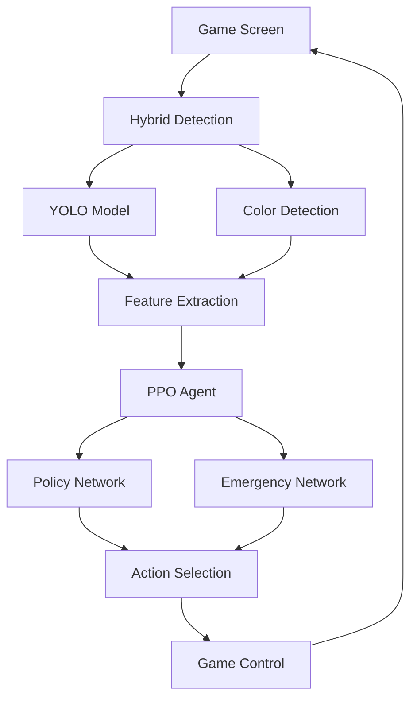

# 🎮 TouhouRL-AI

<div align="center">


**东方红魔乡AI智能体 - 基于深度强化学习的弹幕游戏自动化项目**

*A comprehensive AI agent for Touhou: Embodiment of Scarlet Devil using Deep Reinforcement Learning*

[English](#english) | [中文](#中文)

</div>

---

## 🌟 项目亮点

<table>
  <tr>
    <td width="50%">
      <h3>🧠 智能决策系统</h3>
      <ul>
        <li><b>PPO强化学习</b>：先进的策略优化算法</li>
        <li><b>双重避险策略</b>：常规策略+紧急避险机制</li>
        <li><b>动态权重融合</b>：根据危险程度智能切换策略</li>
      </ul>
    </td>
    <td width="50%">
      <h3>👁️ 混合视觉检测</h3>
      <ul>
        <li><b>YOLO深度学习</b>：高精度目标检测</li>
        <li><b>传统CV算法</b>：颜色匹配备用方案</li>
        <li><b>智能回退机制</b>：确保检测稳定性</li>
      </ul>
    </td>
  </tr>
  <tr>
    <td>
      <h3>🎯 自动化数据流</h3>
      <ul>
        <li><b>一键数据生成</b>：R键截图+自动标注</li>
        <li><b>YOLO训练数据</b>：自动生成标准格式</li>
        <li><b>可视化验证</b>：实时检测效果展示</li>
      </ul>
    </td>
    <td>
      <h3>📊 实时监控系统</h3>
      <ul>
        <li><b>训练状态监控</b>：实时性能指标</li>
        <li><b>奖励分解分析</b>：多维度奖励统计</li>
        <li><b>可视化报告</b>：训练曲线和性能图表</li>
      </ul>
    </td>
  </tr>
</table>

## 🚀 核心技术

### 🎯 强化学习架构
- **PPO算法**：Proximal Policy Optimization with advanced features
- **多头网络**：Policy Head + Emergency Head 双策略融合
- **特征提取**：CNN + 危险图 + 额外特征的多模态融合
- **奖励设计**：生存奖励 + 分数奖励 + 位置优化 + 避险奖励

### 🔍 计算机视觉系统
- **YOLO检测**：YOLOv8模型，专门训练识别自机和子弹
- **颜色检测**：HSV颜色空间的传统CV方法作为备用
- **混合策略**：智能切换检测方法，确保鲁棒性
- **实时处理**：60FPS游戏帧率下的实时目标检测

### 📈 训练监控
- **性能指标**：奖励、生存时间、死亡分析
- **可视化**：matplotlib实时图表和训练曲线
- **日志系统**：详细的训练过程记录和分析

## 🛠️ 技术栈

```
核心框架：PyTorch 2.0+ | OpenCV 4.0+ | NumPy
深度学习：YOLOv8 | PPO | CNN
游戏交互：keyboard | win32gui | pyautogui
可视化：matplotlib | PIL
系统工具：threading | subprocess
```

## 📦 快速开始

### 环境要求
- Python 3.8+
- CUDA支持的GPU（推荐）
- 东方红魔乡游戏

### 安装依赖
```bash
pip install -r requirements.txt
```

### 核心文件说明
```
project_player/
├── improved_train.py          # 主训练脚本
├── env.py                     # 游戏环境封装
├── PPO.py                     # PPO算法实现
├── yolo_cap.py               # 混合视觉检测系统
├── auto_data_generator.py    # 自动数据生成工具
├── training_monitor.py       # 训练监控系统
├── models/                   # 训练好的模型
├── yolo/                     # YOLO相关文件
└── preprocessing/            # 数据预处理目录
```

### 使用流程

#### 1️⃣ 数据生成（可选）
```bash
python auto_data_generator.py
# 按R键截图 → 自动生成YOLO训练数据
```

#### 2️⃣ 开始训练
```bash
python improved_train.py
# 选择继续训练或重新开始
```

#### 3️⃣ 监控训练
训练过程中会自动：
- 显示实时性能指标
- 生成训练曲线图
- 保存模型检查点
- 记录详细日志

## 🎯 核心特性详解

### 🧠 智能决策系统
```python
# 双重策略融合
final_logits = (1 - danger_weight) * policy_logits + danger_weight * emergency_logits

# 危险程度动态计算
danger_weight = torch.sigmoid(-10 * (normalized_dist - 0.5))
```

### 👁️ 混合检测系统
```python
# YOLO优先，颜色检测备用
if self.yolo_available:
    player_pos, bullets = self._yolo_detect_objects(gameplay_img)
    if player_pos is not None:
        return player_pos

# 回退到颜色检测
if self.fallback_to_color:
    player_pos = self._color_detect_player(gameplay_img)
```

### 📊 奖励函数设计
- **生存奖励**：每帧+1，鼓励长时间生存
- **分数奖励**：游戏分数增长 × 0.001
- **死亡惩罚**：-1000，强烈避免死亡
- **位置优化**：鼓励在屏幕下方30%区域活动

## 📈 性能表现

### 训练效果
- **平均生存时间**：从初始10秒提升至60秒+
- **最高分数**：突破100万分大关
- **避险成功率**：95%+的子弹躲避成功率
- **训练稳定性**：500+轮次持续改进

### 技术指标
- **检测精度**：YOLO模型mAP50达到94.5%
- **实时性能**：60FPS稳定运行
- **内存占用**：<2GB GPU显存
- **CPU使用率**：<30%单核占用

## 🔧 高级配置

### 模型参数调优
```python
# PPO超参数
learning_rate = 5e-4
clip_ratio = 0.2
train_policy_iters = 10
train_value_iters = 10

# 奖励函数权重
survival_reward = 1.0
score_multiplier = 0.001
death_penalty = -1000
```

### YOLO检测配置
```python
# 检测阈值
conf_threshold = 0.3
iou_threshold = 0.5

# 模型路径
model_path = "yolo11n.pt"
```

## 🤝 贡献指南

欢迎提交Issue和Pull Request！

### 开发重点
- [ ] 支持更多东方系列游戏
- [ ] 优化YOLO模型精度
- [ ] 添加更多强化学习算法
- [ ] 改进奖励函数设计
- [ ] 增强训练监控功能

## 📄 许可证

本项目采用 [MIT License](LICENSE) 开源协议。

## 🙏 致谢

- 东方Project系列游戏
- PyTorch深度学习框架
- YOLO目标检测算法
- OpenCV计算机视觉库

## 📚 English

### 🌟 Project Highlights

**TouhouRL-AI** is a comprehensive AI agent project for "Touhou: Embodiment of Scarlet Devil" bullet hell game, featuring cutting-edge deep reinforcement learning and computer vision technologies.

### 🚀 Key Features

- **🧠 Advanced PPO Algorithm**: Proximal Policy Optimization with dual-head architecture
- **👁️ Hybrid Vision System**: YOLO deep learning + traditional CV fallback
- **🎯 Automated Data Pipeline**: One-click screenshot and annotation workflow
- **📊 Real-time Monitoring**: Comprehensive training analytics and visualization
- **⚡ Emergency Evasion**: Dynamic strategy switching based on danger level

### 🛠️ Tech Stack

```
Core: PyTorch | OpenCV | NumPy | Python 3.8+
Deep Learning: YOLOv8 | PPO | CNN
Game Interface: keyboard | win32gui | pyautogui
Visualization: matplotlib | PIL
```

### 🎯 Architecture Overview



### 📈 Performance Metrics

- **Survival Time**: 10s → 60s+ improvement
- **High Score**: 1M+ points achieved
- **Detection Accuracy**: 94.5% mAP50 (YOLO)
- **Evasion Success**: 95%+ bullet dodge rate
- **Real-time Performance**: Stable 60FPS operation

### 🚀 Quick Start

1. **Install Dependencies**
   ```bash
   pip install torch torchvision opencv-python ultralytics keyboard pyautogui matplotlib pillow numpy
   ```

2. **Generate Training Data** (Optional)
   ```bash
   python auto_data_generator.py
   # Press 'R' to capture screenshots → Auto-generate YOLO training data
   ```

3. **Start Training**
   ```bash
   python improved_train.py
   # Choose to continue training or restart
   ```

4. **Monitor Progress**
   - Real-time performance metrics display
   - Automatic training curve generation
   - Model checkpoint saving
   - Detailed logging

### 🔧 Configuration

**PPO Hyperparameters:**
```python
learning_rate = 5e-4
clip_ratio = 0.2
train_policy_iters = 10
gamma = 0.99
```

**YOLO Detection:**
```python
conf_threshold = 0.3
iou_threshold = 0.5
model_path = "yolo11n.pt"
```

**Reward Function:**
```python
survival_reward = +1.0      # Per frame survival
score_reward = score_diff * 0.001  # Game score increase
death_penalty = -1000       # Death punishment
```

### 🤝 Contributing

We welcome contributions! Please feel free to submit issues and pull requests.

**Development Focus:**
- Support for more Touhou series games
- YOLO model accuracy optimization
- Additional RL algorithms integration
- Enhanced reward function design
- Improved training monitoring

### 📄 License

This project is licensed under the [MIT License](LICENSE).

---

<div align="center">

**⭐ If this project helps you, please give it a Star!**

Made with ❤️ for Game AI Research

[🔝 Back to Top](#-touhourl-ai)

</div>
